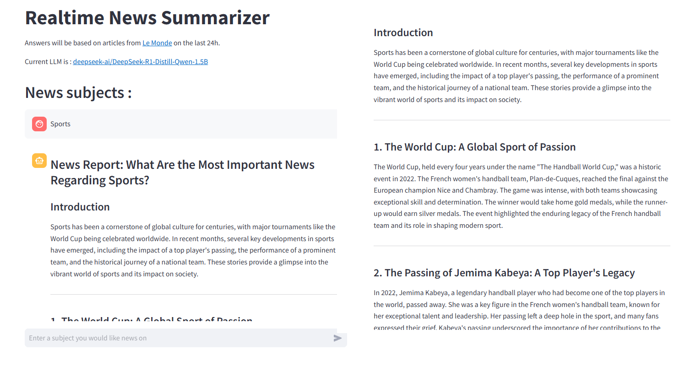

# RealTime_News_Summarizer - "Chat GPT like"
Using DeepSeek + Langchain for realtime RAG summarizing news from selected web site(s) with scrapping.

### About This Project
Just a tiny project to develop my skills with langchain, scrapping, RAG, and usage of deepseek.
The idea is to have an app prompting user for news on a specific topic on the last 24h. Using langchain for RAG and automation. scrapping (beautifulsoup4), and deepseek for summerizing. 
As i am french, my goal is to make this work with one of the major news french website : [Le Monde](https://www.lemonde.fr/).  
Unfortunately, the model i am using has poor performance in french, and does not translate well from english. So everything is in english.

This will stay a POC and I would use all the least resource-intensive methods, namely the lightest distilled model from deepseek : [DeepSeek-R1-Distill-Qwen-1.5B](https://huggingface.co/deepseek-ai/DeepSeek-R1-Distill-Qwen-1.5B) using Qwen-1.5B architecture finetuned on data generated by DeepSeek R1 (showing fine results). Should be enought for summarization. We will talk about possible improvements at the end of the project.

### No link to application
I have not uploaded this application in any cloud service (mainly for ressource cost). 
Its already taking quite some time on my rtx 3090 (~1 minute) so i didn't wanted to find 'the right' provider to host this project a low cost and wait several minutes for deepseek to answer on a cpu. It is just a little project and is far from being ready for production.   
So, only images for presentation, you can also find some saved HTML pages in the /exemples folder.

# What it does

The app load and scrap all articles from [LeMonde.fr](https://www.lemonde.fr/) on the present date and the day before.
Then chunk those articles, and ask for the user topics he would like news on. This topic is inserted in a more structured prompt (alongside articles on the subject) and this prompt is given to the llm model. Finally we show the response, and the source links that was given to the prompt (related to the topic).  
Exemples at the end.  

  

# How it's done : simple RAG System
## 1. Scrapping 'Le Monde'
Full code exemple available [here](https://github.com/ohmatheus/RealTime_News_Summarizer/blob/main/sandbox/1_scrapping_tests.ipynb)  
There is an archive link from where we can get a list of articles links from Le Monde https://www.lemonde.fr/archives-du-monde/.  
From there its possible to iterate through those links, and using Beautifulsoup to retreive html text under title and paragraph tags. Everything is organised in lists and disctionnaries. Articles are then saved in text files.


## 2. Vector Database
Full code exemple available [here](https://github.com/ohmatheus/RealTime_News_Summarizer/blob/main/sandbox/2_langchain_rag_tests.ipynb)  
We load previously saved text files with langchain's `Document` class. Those document are then splitted using `RecursiveCharacterTextSplitter` on the `max_size` of the embedding model we are using.

Via `HuggingFaceEmbeddings (langchain)` we then embbed those chunks and save them in a vector_database (using facebook's [FAISS](https://github.com/facebookresearch/faiss)). The retrieving process is done through cosine similarity.

## 3. Prompt
```python 
prompt_in_chat_format = [
    {
        "role": "system",
        "content": """
You are a journalist summerizing news for the last 24 hours. 
For each document in context, try to retreive information related to the user's subject, and select document that are relevant.
If there is no explicit link between a document and the subject, ignore this document.
If you don't have enought information to make a report based on the subject, say that you can't make a report.
Then, If you have enought information, make a very detailed news report with the information from the selected documents. 
Just give facts, don't draw any conclusions.

Context:
{context}

""",
    },
    {
        "role": "user",
        "content": """
---
Now, here are the subjects from which you should build your news reports.

subject: What are the most important news reguarding {subject} ? """,
    },
]
```

## 4. Reader - LLM
We are using the lightest distilled model trainned by deepseek : "deepseek-ai/DeepSeek-R1-Distill-Qwen-1.5B" and is then quantized on 4-bit on loading. This mean that while having 'some' thinking capabilities, it is expected to perform poorly, as this is only a poc and i just wanted to create a mini rag pipeline.  
Deepseek generate `<think>[...]</think>` tokens before its response, explanning all its thinking process. For exemple, for a mathematical operation, it will explain step by step all the factorisation and all different process he went through before giving an answer.  
Those tokens are removed in this application.  


## 5. Results

### 'Sports'
  
  

### 'Trump'
  
  
 
### Final thoughts
This app is very error prone. The model completely hallucinates some parts and sometimes create informations that does not exists, linking the topic with articles that was given to him in the context, where there was no link. This could maybe be mitigated by using a better prompt, a better selection of the articles given to him, or using a more powerfull model probably, but for now we cannot trust this application.

## 5. Possible Improvements
- Better selection of articles to put in the context :
    - Reranking
    - Adding metadata (like tags) in documents.
- Better prompt : Currently asked to iterate throught each document -> leading to hallucianation because he is sometimes linking documents that have no link whatsoever with our subject's.
- Test with better LLM. Maybe one with better french capabilities so i can make an all french application.
- Adding links of selected documents at the end.
- Narrow the scrapping and the search for only the last 24h news. Maybe find a way to pre-select only the most important new (internationnal for exemple)


## Links
### Inspirations:
- [Langchain (Upgraded) + DeepSeek-R1 + RAG Just Revolutionized AI Forever](https://pub.towardsai.net/langchain-upgraded-deepseek-r1-rag-just-revolutionized-ai-forever-27dcbb0e3493)
- [Developing RAG Systems with DeepSeek R1 & Ollama](https://sebastian-petrus.medium.com/developing-rag-systems-with-deepseek-r1-ollama-f2f561cfda97)
- (FR) [Scraper « le monde » et construire ton propre corpus](https://xiaoouwang.medium.com/scraper-le-monde-et-construire-ton-propre-corpus-d47fa81eb3d9)
### Model:
[DeepSeek-R1-Distill-Qwen-1.5B](https://huggingface.co/deepseek-ai/DeepSeek-R1-Distill-Qwen-1.5B)
